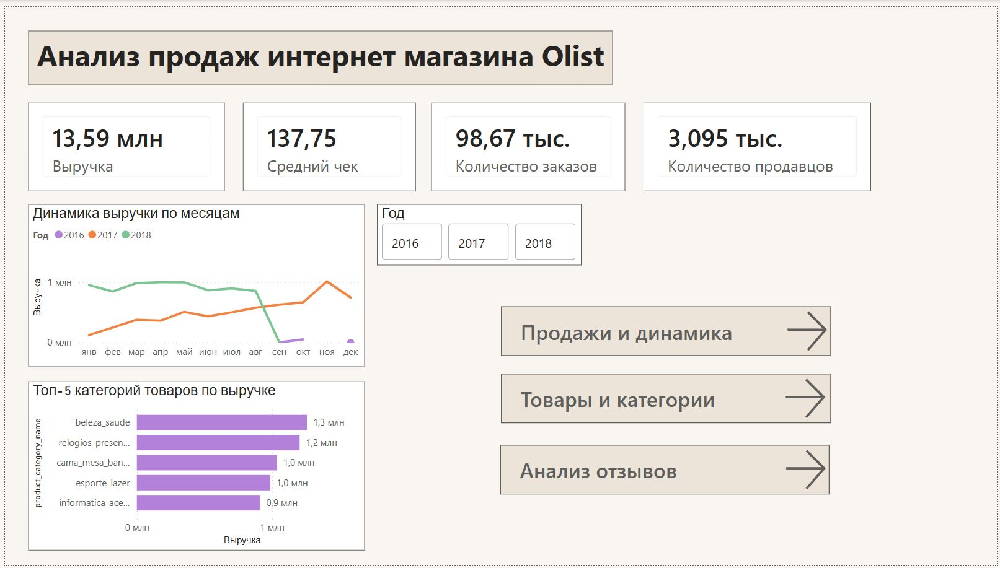
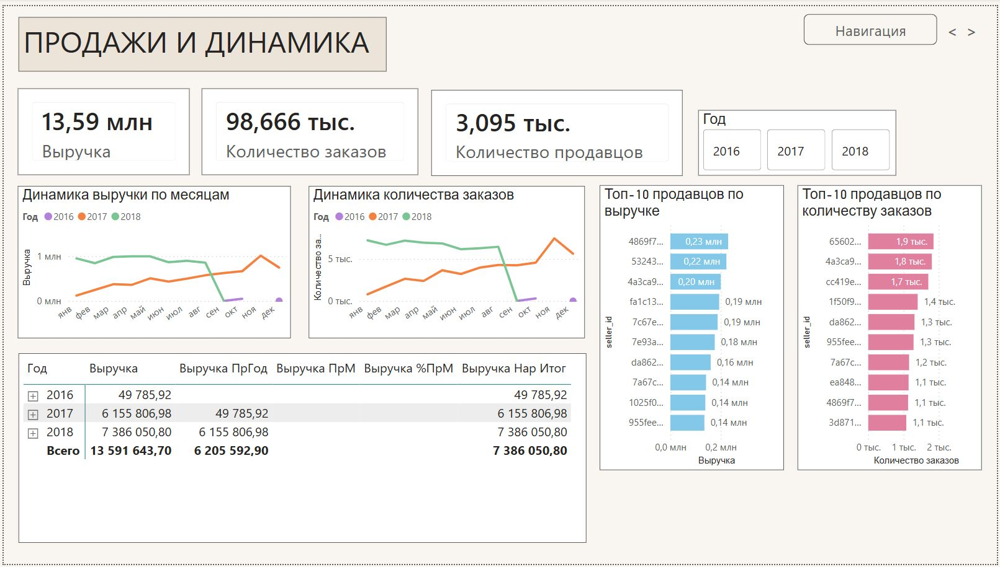
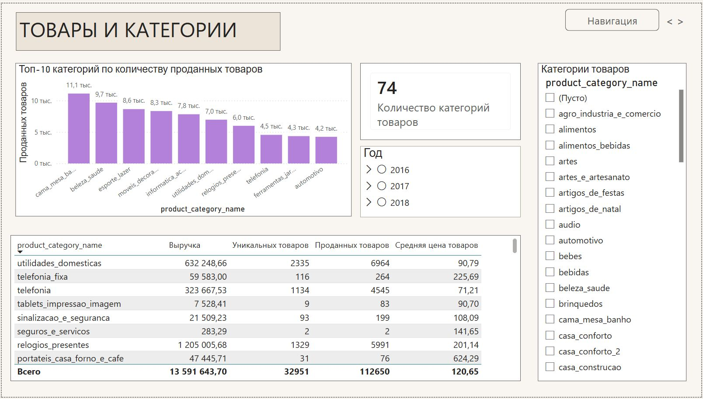
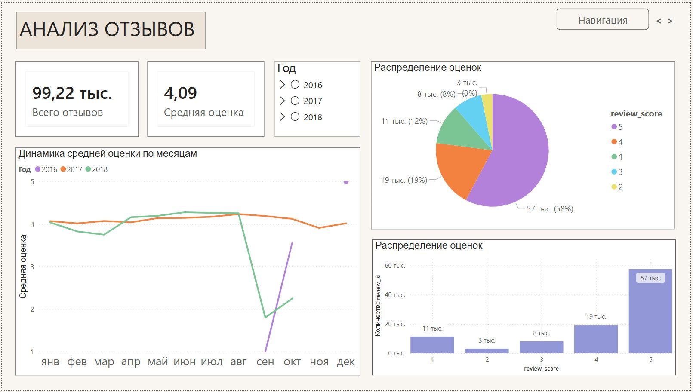

# data-analyst-portfolio
Портфолио проектов по анализу данных: SQL, Python, Power BI, Excel.

## 📊 Дашборд в Power BI

Интерактивный отчёт по продажам интернет-магазина Olist (выручка, средний чек, топ-категории, анализ продавцов, отзывы).

- **Скачать файл `.pbix`** (Power BI Desktop): [Ссылка на файл на Google Диске](https://drive.google.com/file/d/1pKFsotzXYlLWfth1KISY_1fiC6gMkCCa/view?usp=sharing)  
- **Скриншоты страниц:**  
  - [Главная страница](https://drive.google.com/file/d/19arFekSjeqv1O3ZpblvFIugFd2OwAEEt/view?usp=sharing)  
  - [Динамика выручки](https://drive.google.com/file/d/1zsn1X3SIHs451lekFA_q2kfxTXp6CETP/view?usp=sharing)  
  - [Товары и категории](https://drive.google.com/file/d/1PZde5agDkjH1Wxx5tNnHMak_4UMFXeJ4/view?usp=sharing)  
  - [Анализ отзывов](https://drive.google.com/file/d/1J_IMGatyb9mJSK3dIp_nBD2htyDAy3oN/view?usp=sharing)

## 📸 Скриншоты дашборда

| Главная страница | Динамика выручки |
|------------------|------------------|
|  |  |

| Товары и категории | Анализ отзывов |
|--------------------|----------------|
|  |  |

> Для просмотра дашборда установите бесплатный Power BI Desktop (ссылка на официальном сайте Microsoft). Данные внутри файла, интернет не требуется.
