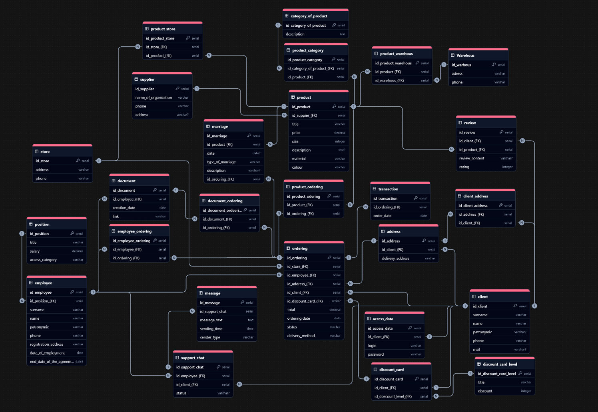

# data-analyst-portfolio
Портфолио проектов по анализу данных: SQL, Python, Power BI, Excel.

## 🗄️ Проектирование базы данных магазина одежды (SQL)

**Задача:** спроектировать реляционную базу данных для интернет-магазина одежды, создать таблицы, связи, первичные/внешние ключи. Написать аналитические запросы.

**Что сделано:**
- Разработана схема БД (ER-диаграмма – концептуальная, логическая, физическая).
- Созданы таблицы `customers`, `products`, `orders`, `order_items` (PostgreSQL).
- Написаны запросы с оконными функциями, JOIN, подзапросами:  
  - топ‑3 товара в каждой категории по выручке (`RANK()`)  
  - для каждого заказа – дата предыдущего заказа того же клиента (`LAG()`)  
  - скользящее среднее суммы заказа за последние 3 дня (`AVG OVER`)

**Файлы:**
- [Схема БД (schema.sql)](sql_shop_database/schema.sql)
- [Аналитические запросы](sql_shop_database/queries.sql) – если такой файл есть (создай отдельно, если нет)
- [ER-диаграмма](sql_shop_database/physical_diagram.png) – укажи правильное имя файла (physical_diagram.png или conceptual_diagram.png)

**ER-диаграмма (физическая модель):**

## 🐍 Python: Разведочный анализ данных Olist

- **Файл:** [`olist_sales_analysis.ipynb`](python/olist_sales_analysis.ipynb)
- **Цель:** выявить сезонность, топ-категории, распределение сумм заказов.
- **Инструменты:** pandas, numpy, matplotlib.
- **Основные результаты:**
  - Выручка: 13,59 млн долл., средний чек: 137,75 долл.
  - Пик заказов – ноябрь.
  - Топ-3 категории: красота и здоровье, часы и подарки, постельное бельё.
  - Большинство заказов – до 150 долл.

## 📊 Дашборд в Power BI

Интерактивный отчёт по продажам интернет-магазина Olist (выручка, средний чек, топ-категории, анализ продавцов, отзывы).

- **Скачать файл `.pbix`** (Power BI Desktop): [Ссылка на файл на Google Диске](https://drive.google.com/file/d/1pKFsotzXYlLWfth1KISY_1fiC6gMkCCa/view?usp=sharing)  

## 📸 Скриншоты дашборда

| Главная страница | Продажи и динамика |
|------------------|------------------|
|  |  |

| Товары и категории | Анализ отзывов |
|--------------------|----------------|
|  |  |

> Для просмотра дашборда установите бесплатный Power BI Desktop (ссылка на официальном сайте Microsoft). Данные внутри файла, интернет не требуется.

